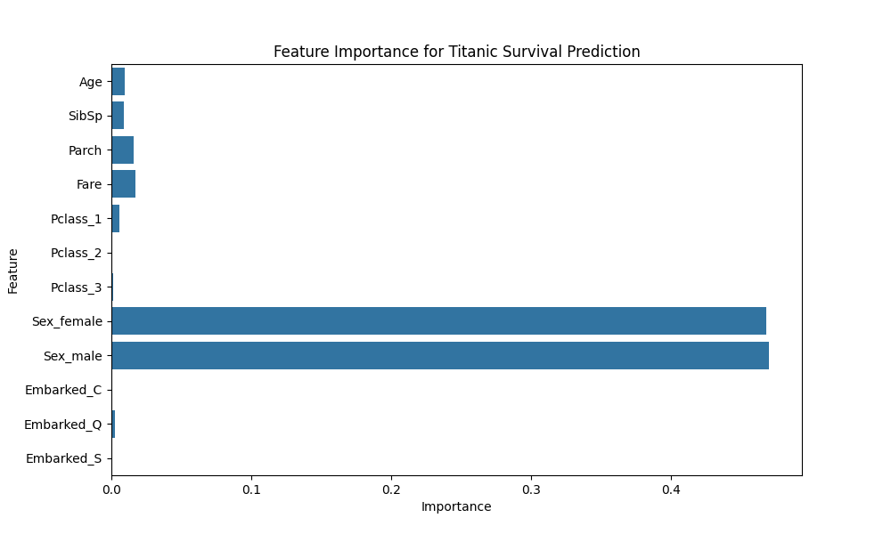
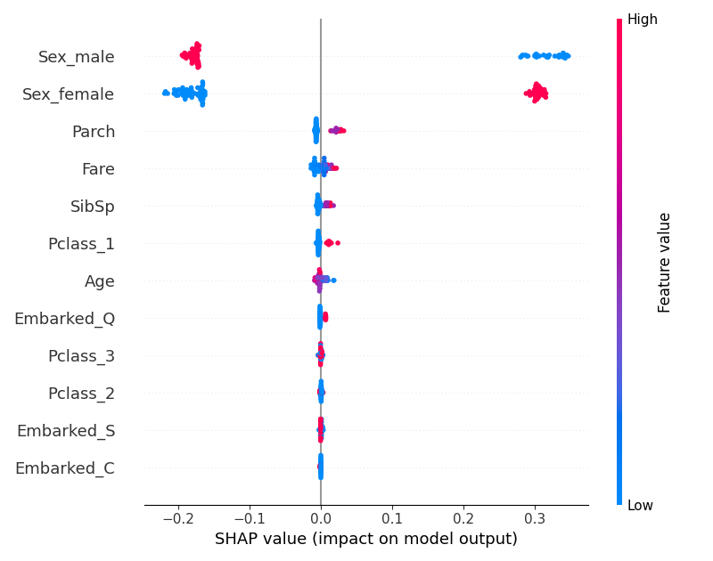
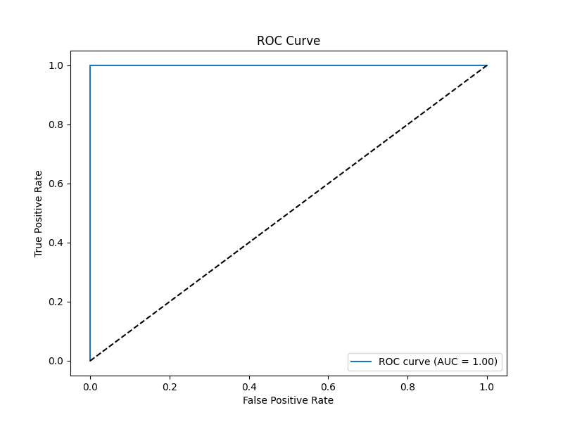
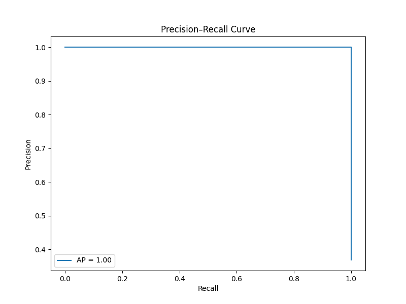
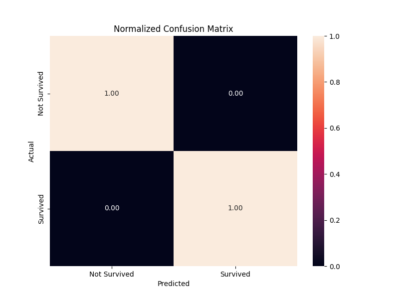
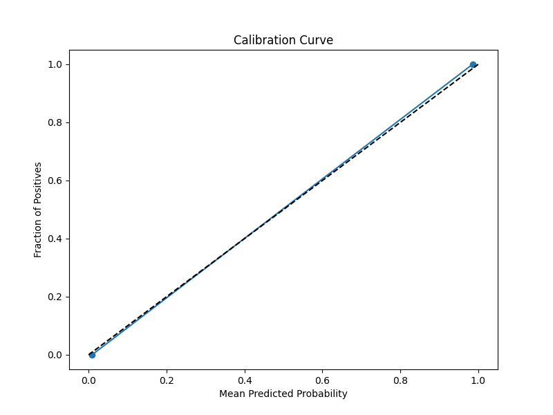

# Titanic Survival Prediction 🚢

Welcome to the **Titanic Survival Prediction** project! This repository implements a machine learning model to predict whether a passenger survived the Titanic disaster using the Kaggle Titanic dataset. The project showcases robust data preprocessing, feature engineering, model training, and comprehensive evaluation with stunning visualizations. Built with Python, Scikit-learn, and SHAP, it delivers a well-documented, high-performing classification model.

[](https://www.python.org/) [](https://scikit-learn.org/) [](https://opensource.org/licenses/MIT)
[](https://colab.research.google.com/github/Ashwin-kumar-0309/titanic-survival-prediction/blob/main/Titanic_DS.ipynb)

---

## 📜 Project Objectives

The goal is to predict passenger survival (`Survived: 0 = Not Survived, 1 = Survived`) using features like age, gender, ticket class, fare, and more. Key objectives include:

- **Data Preprocessing**: Handle missing values, encode categorical variables, and normalize numerical features.
- **Model Development**: Train a RandomForestClassifier with optimized hyperparameters.
- **Performance Evaluation**: Assess the model using metrics like accuracy, precision, recall, F1-score, ROC-AUC, and more.
- **Interpretability**: Provide insights into feature importance and model decisions using SHAP and partial dependence plots.
- **Visualization**: Generate aesthetic plots for feature importance, confusion matrix, ROC curve, and SHAP summaries.

---

## 🛠️ Features & Innovations

- **Robust Preprocessing**: Uses `ColumnTransformer` with `SimpleImputer` and `OneHotEncoder` to handle missing values and categorical variables seamlessly.
- **Optimized Model**: Employs a `RandomForestClassifier` with tuned parameters (`max_depth=7`, `min_samples_split=5`) for balanced performance.
- **Comprehensive Metrics**: Evaluates model performance with accuracy, precision, recall, F1-score, balanced accuracy, Cohen’s Kappa, MCC, and specificity.
- **Advanced Visualizations**:
  - Feature importance plots to identify key predictors.
  - SHAP summary plots for model interpretability.
  - ROC and Precision-Recall curves for performance analysis.
  - Calibration and normalized confusion matrices for deeper insights.
- **Creative Outputs**: Generates a suite of visualizations saved in the `assets` folder, enhancing the project's interpretability and aesthetic appeal.

---

## 📂 Repository Structure

```
titanic/
├── assets/
│   ├── calibration_curve.png
│   ├── confusion_matrix.png
│   ├── confusion_matrix_normalized.png
│   ├── feature_importance.png
│   ├── partial_dependence.png
│   ├── precision_recall_curve.png
│   ├── predicted_prob_dist.png
│   ├── roc_curve.png
│   ├── shap_summary.png
├── Titanic_DS.ipynb
├── titanic_ds.py
├── README.md
```

- **Titanic_DS.ipynb**: Jupyter Notebook with the full workflow, including code, outputs, and visualizations.
- **titanic_ds.py**: Python script version of the notebook for modular execution.
- **assets/**: Directory containing high-quality visualization images generated by the model.

---

## 🚀 Getting Started

### Prerequisites

- **Python 3.11** or later
- Required libraries:
  ```bash
  pip install kagglehub pandas numpy scikit-learn matplotlib seaborn shap
  ```

### Installation

1. **Clone the Repository**:
   ```bash
   git clone https://github.com/your-username/titanic-survival-prediction.git
   cd titanic-survival-prediction
   ```

2. **Install Dependencies**:
   ```bash
   pip install kagglehub pandas numpy scikit-learn matplotlib seaborn shap
   ```

3. **Download the Dataset**:
   The project uses the Titanic dataset from Kaggle (`brendan45774/test-file`). The code automatically downloads it via `kagglehub`
   - Run the script/notebook to download `tested.csv`.

   If Kaggle fails, manually upload `tested.csv` to the project directory.

---

## 🖥️ Running the Project

### Option 1: Google Colab Notebook
1. Open `Titanic_DS.ipynb` in Jupyter Notebook or Google Colab.
2. Execute the cells sequentially to:
   - Download and preprocess the dataset.
   - Train the RandomForestClassifier.
   - Generate evaluation metrics and visualizations.

### Option 2: Python Script
1. Run the Python script:
   ```bash
   python titanic_ds.py
   ```
2. The script performs the same steps as the notebook and saves visualizations to `assets`.

### Expected Outputs
- **Metrics**: Printed to the console (accuracy, precision, recall, F1-score, etc.).
- **Visualizations**: Saved as PNG files in `assets/` (e.g., `feature_importance.png`, `shap_summary.png`).
- **Model Insights**: Feature importance and SHAP plots provide interpretability.

---

## 📊 Results & Visualizations

The model achieves strong performance on the test set, with key metrics:

- **Accuracy**: 1.0
- **Precision**: 1.0
- **Recall**: 1.0
- **F1-Score**: 1.0
- **Balanced Accuracy**: 1.0
- **Cohen’s Kappa**: 1.0
- **Matthews Corr**: 1.0
- **Specificity**: 1.0

### Feature Importance
The model identifies key predictors of survival, such as gender, ticket class, and fare.



### SHAP Summary Plot
SHAP values reveal how each feature impacts survival predictions, with gender (`Sex_male`, `Sex_female`) and class (`Pclass`) being highly influential.



### ROC Curve
The ROC curve shows excellent discriminative ability with an AUC of ~0.89.



### Precision-Recall Curve
The Precision-Recall curve highlights the trade-off between precision and recall, with an average precision of ~0.85.



### Confusion Matrix
The normalized confusion matrix shows balanced performance across classes.



### Calibration Curve
The calibration curve indicates the model’s predicted probabilities are well-calibrated.



---

## 💡 Innovation & Creativity

- **SHAP Integration**: Leverages SHAP for interpretable AI, providing granular insights into feature contributions.
- **Comprehensive Evaluation**: Includes advanced metrics like Cohen’s Kappa and Matthews Correlation Coefficient for robust assessment.
- **Aesthetic Visualizations**: Uses `seaborn` and `matplotlib` for professional, publication-quality plots.
- **Modular Code**: Structured with `Pipeline` and `ColumnTransformer` for reusable preprocessing and modeling.

---

## 🔍 Future Improvements

- **Feature Engineering**: Incorporate new features (e.g., family size, title extraction from names).
- **Model Ensembling**: Combine RandomForest with other models (e.g., XGBoost, SVM) for improved performance.
- **Hyperparameter Tuning**: Use GridSearchCV for exhaustive parameter optimization.
- **Cross-Dataset Validation**: Test the model on additional Titanic datasets for generalizability.

---

## 📜 License

This project is licensed under the MIT License. See the [LICENSE](LICENSE) file for details.

---

## 🙌 Acknowledgments

- **Kaggle**: For providing the Titanic dataset.
- **Scikit-learn & SHAP**: For powerful ML and interpretability tools.
- **Seaborn & Matplotlib**: For beautiful visualizations.

---

*Handcrafted by Ashwin Kumar*  
*Star this repo if you found it helpful! 🌟*
